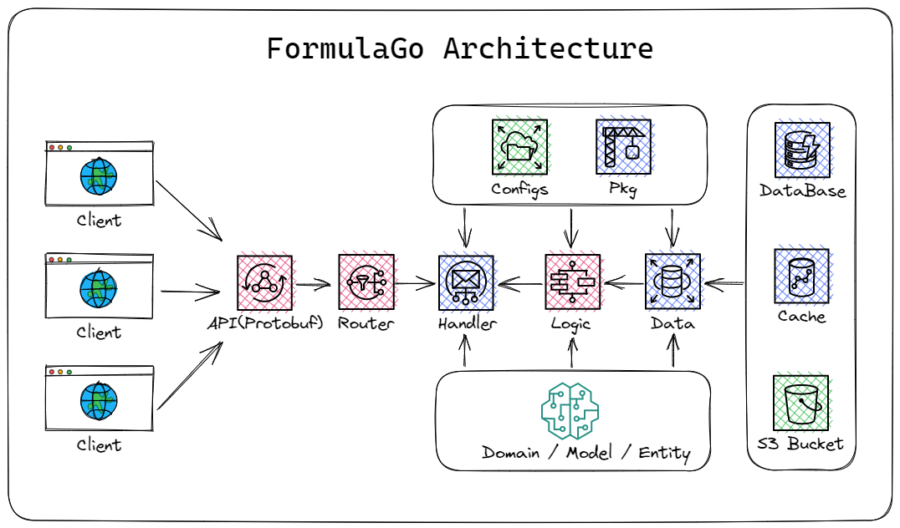

# FormulaGo
English | [中文](README_CN.md)

## Introduce
A high performance admin project framework with `Hertz` and `Ent`
- High productivity: An enterprise management system can be built in a short time.
- High performance: Uses the [Hertz framework](https://github.com/cloudwego/hertz), the most powerful in Go. ByteDance has deployed tens of thousands of services using it.
- Modularity: Referring to the DDD design concept, the module design is more concise and convenient.
- Routing interfaces: Refer to the [Google Open Platform](https://github.com/googleapis/googleapis) and use Protobuf to define interface specifications.
- Interface development, better expansion and Unit Test.

## Architecture
`Does it look like an F1 car ?`


## Dependencies
- Use `Hertz` as HTTP framework
- Use `Protobuf` IDL to define `HTTP` interface
- Use `hz` to generate code
- Use `Ent` and `MySQL`

## Built-in features
1. User management: The user is the system operator, and this function mainly completes the system user configuration.
2. Menu management: Configure system menus, operation permissions, button permission identification, etc.
3. Role management: Assign permissions in the role menu and set the permission division of roles.
4. Dictionary management: Maintain some relatively fixed data that is often used in the system.
5. Operation log: System normal operation log records and queries; System exception information logging and querying.
6. Online users: Active user token status monitoring in the current system.
7. File management: File upload, S3 (Aliyun OSS) multiple upload methods adapted.
8. OAuth2.0 login: Support Google, Github, Wecom, etc.
9. Common tools: Integrate common toolkits and command line tools in pkg package.

## Interface IDL

This project use `Protobuf` IDL to define `HTTP` interface. The specific admin interface define in [admin.proto](api/admin/admin.proto).

## Code generation tool

This project use `hz` to generate code. The use of `hz` refers
to [hz](https://www.cloudwego.io/docs/hertz/tutorials/toolkit/toolkit/).

- hz new: Create a new Hertz project.
```bash
hz new -I api -idl api/admin/admin.proto -model_dir api/model -module formulago --unset_omitempty
```
- hz update: Update an existing project, while you update the IDL file.
```bash
hz update -I api -idl api/admin/admin.proto -model_dir api/model --unset_omitempty
```

## Binding and Validate
The use of binding and Validate refers
to [Binding and Validate](https://www.cloudwego.io/docs/hertz/tutorials/basic-feature/binding-and-validate/).

## Ent
ent - An Entity Framework For Go.

This project use `Ent` to operate `MySQL` and refers to [Ent](https://github.com/ent/ent).

#### Quick Start
- Update the Database DSN to your own in [Database config file](configs/config.yaml).
- Go to the root directory of your project, and run following command, will generate the schema for User under data/ent/schema/ directory:
```bash
  cd data
  go run -mod=mod entgo.io/ent/cmd/ent init User
  ```
- Add fields to the User schema, run go generate to produce the ent operation files
```bash
  go generate ./ent
  ```
- For more Ent usage, please refer to [Ent Guides](https://entgo.io/).

## How to run

### Modify the configuration file
- Modify [Prod configuration file](configs/config.yaml) and [Dev configuration file](configs/config_dev.yaml) to your own.
- Note that the structure of Yaml should be consistent with the config struct definition.
- While the running environment variable "IS_PROD" is true, the prod configuration file will be used, otherwise the dev configuration file will be used.

### Run MySQL by Docker
```bash
cd formulago && docker-compose up
```

### Run Project
```
cd formulago
go build -o formulago &&./formulago

# init Database Table data by http request
# Administrator account: admin/admin123
@router yourHost/api/initDatabase [GET]
enjoy it!
```

### Feel free to contribute code or provide suggestions